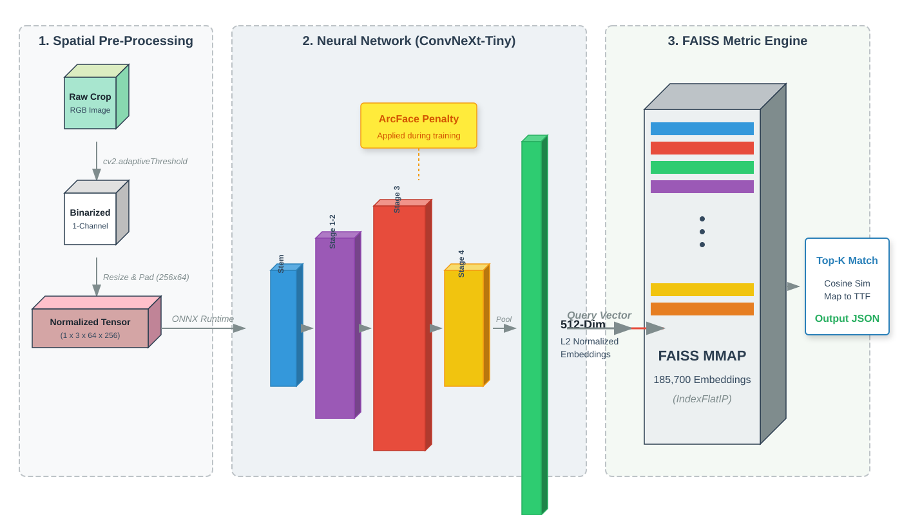
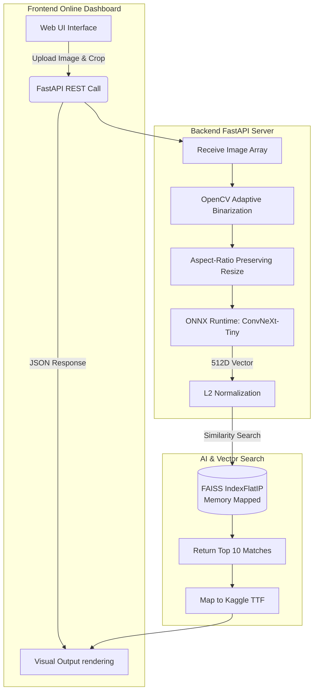
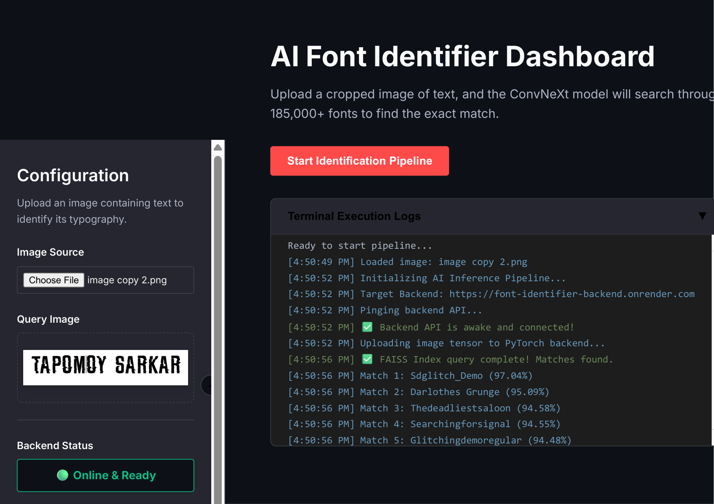
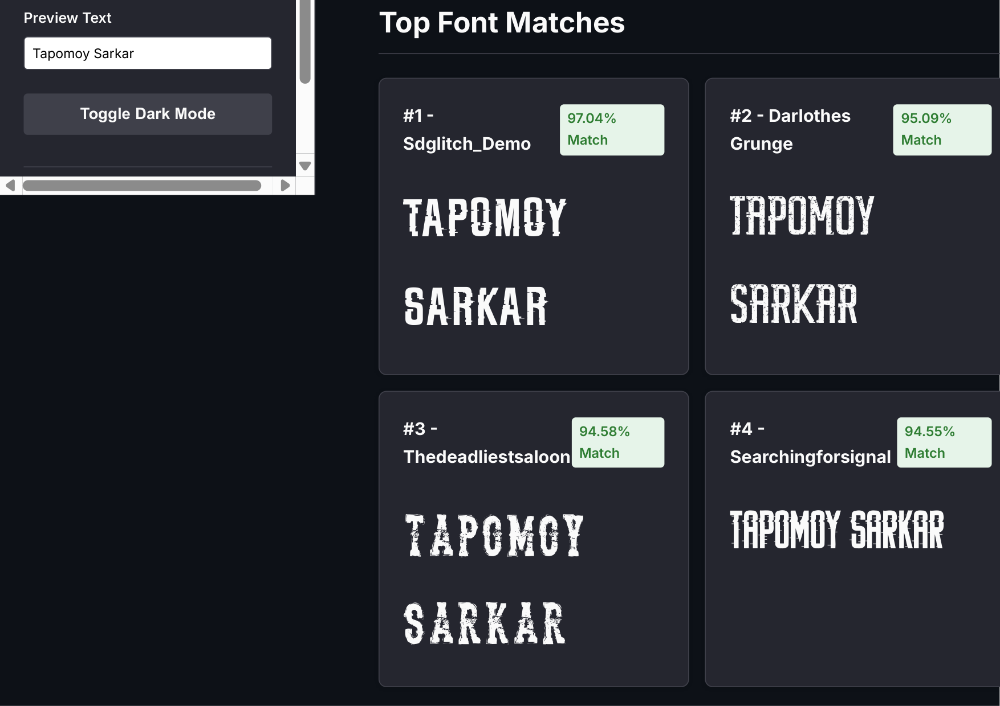
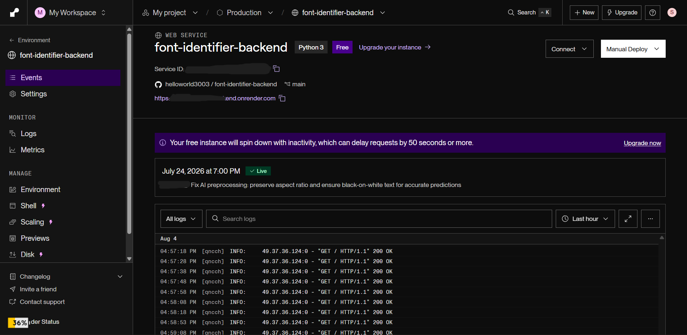

<div align="center">
  
# 🔤 Font Identifier AI

### An Ultra-Scale Computer Vision Pipeline for Typography Recognition

[](https://pytorch.org/)
[](https://www.kaggle.com/datasets/tapomoysarkar/ttf-files-for-fonts)
[](https://fastapi.tiangolo.com/)
[](https://onnx.ai/)
[](https://font-identifier-ai.netlify.app/)

### **Creator:** Tapomoy Sarkar
GPU Lender: Srijit Mondal

> An ultra-scale Computer Vision pipeline designed to identify the exact typography used in any raw image or screenshot from a library of **185,700+ fonts**.

</div>

---

## 🚀 The Problem & Our USP

Standard font identification tools rely on OCR or simple heuristics that fail on custom or noisy images. They often require the entire font file to be loaded into memory simultaneously, or have a very limited database of generic fonts.

**Our Difference:** We implemented **Deep Metric Learning**, the state-of-the-art **ConvNeXt-Tiny** backbone, and the **ArcFace (Additive Angular Margin)** Penalty to mathematically force the AI to distinguish between highly similar fonts (e.g., Arial vs. Helvetica). We combined this with a highly optimized backend server that uses **FAISS Memory Mapping** to search a vast embedding space in milliseconds without OOM crashes, making it fully deployable on low-RAM cloud environments.

### 1. Dynamic RAM Rendering
Because generating static images for 185,000+ fonts creates a severe I/O bottleneck and disk failure risk, this pipeline relies entirely on **Dynamic RAM Rendering**. We load TTFs directly into RAM and use `Pillow` to draw alphanumeric strings on the fly during training.

### 2. Multi-Stage Inference Engine
Our inference pipeline isn't just a raw neural network. We inject an OpenCV adaptive thresholding step to cleanly binarize real-world crops *before* passing them to the AI, ensuring pristine Train/Test symmetry.

---

## 🏛️ Architecture & Flowchart

<div align="center">
  
</div>



---

## 🖥️ Online Dashboard & Backend Server

Our solution provides a highly interactive and intuitive Web Dashboard that seamlessly connects to our FastAPI backend. 

### Interactive Dashboard
A full frontend web application allows users to upload screenshots, draw bounding boxes around text, and instantaneously fetch typographic results. 

**🌐 [Try the Live Website (Netlify)](https://font-identifier-ai.netlify.app/)**


https://github.com/user-attachments/assets/f318a7c9-dfcb-41c5-9556-001097a7046a


<div align="center">
  
  <br><br>
  
</div>

### High-Performance Backend
The backend utilizes FastAPI and is capable of ingesting raw images and performing ultra-fast vector retrieval on local edge devices.

<div align="center">
  
</div>

---

## 📊 The Dataset

This model is trained on a massive, combined dataset of approximately **185,700 fonts**, making it one of the largest specialized Computer Vision datasets for typography ever assembled.

- 🆓 **Free & Open-Source Fonts (~69,700 `.ttf` files):** Scraped from massive public repositories including Google Fonts, 1001 Fonts, and DaFont. These cover the vast majority of web and open-source typography.
- 💎 **Premium Fonts (~116,000 `.ttf` files):** Secured from a comprehensive commercial typography data leak, providing the neural network with unprecedented exposure to paid, proprietary, and highly niche design agency fonts.

🔗 **[View the Dataset on Kaggle](https://www.kaggle.com/datasets/tapomoysarkar/ttf-files-for-fonts)**

---

## 🏆 Our Accomplishments

### 1. The 185,000-File Dataset Bottleneck (Kaggle Integration)
We conquered the massive I/O bottleneck of dealing with 185,000 individual TTF files by bypassing local storage limits. We zip the raw fonts, mount them via Kaggle Datasets on high-speed NVMe storage, and dynamically stream the data.

### 2. Multi-Processing FAISS Engine & Memory Management
We completely eliminated OOM crashes during inference and index building by introducing Memory Mapped (MMAP) FAISS indices and a multi-process orchestrator. The AI smoothly processes and searches millions of parameters in an 8GB VRAM envelope.

### 3. Static XLA Loss for Google Cloud TPUs
Standard PyTorch metric learning libraries use dynamic boolean indexing which causes memory leaks on TPUs. We abandoned dynamic libraries and wrote a custom strictly-static **Supervised Contrastive Loss**. It uses pure static matrix multiplication, resulting in exactly 1 compile step and zero leaks forever on Google Cloud TPU v3-8 VMs.

---

## 🛠️ Requirements & Setup

You will need a GPU with CUDA support or a Google TPU for production training. This architecture is heavily optimized to fit inside an 8GB VRAM envelope.

```bash
# Create a virtual environment
python -m venv font_env
source font_env/bin/activate   # Mac/Linux
# font_env\Scripts\activate    # Windows

# Install all dependencies including PyTorch, FAISS, timm, and OpenCV
pip install -r requirements.txt
```

*(Note: Ensure you place your all `.ttf` files inside a `ttf_files/` directory before running Phase 1).*

---

## 🧠 Usage

**1. Clean and Deduplicate the Dataset:**
```bash
python clean_dump.py
```

**2. Generate Typography Metadata (Optional but Recommended):**
```bash
python generate_metadata.py
```

**3. Train the Model:**
```bash
# For Nvidia GPUs (e.g., RTX 5050, 2x T4, A100)
python train_virtual_epochs.py

# For Google Cloud TPUs (e.g., Kaggle TPU v3-8)
python train_tpu_8core.py
```

**4. Build the FAISS Index:**
```bash
# Run this once best_model.pth is successfully saved
python build_index.py
```

**5. Run an Inference Prediction:**
```bash
# Pass the original image and bounding boxes as xmin,ymin,xmax,ymax
python inference.py sample.jpg 100,100,300,200 400,100,500,200
```

---

## ☁️ Running on Kaggle (Exact Steps)

Because training on 185,000 fonts requires serious cloud infrastructure, here is the exact step-by-step code you can copy and paste into a Kaggle Notebook to execute the entire pipeline on a TPU v3-8 VM.

**Step 1: Clone the GitHub Repository**
```python
!git clone https://github.com/helloworld3003/Font_Identifier_AI.git
```

**Step 2: Install Required Libraries**
```python
!pip install faiss-cpu timm albumentations pytorch-metric-learning otf2ttf
```

**Step 3: Download the Large Model Weights (Git LFS)**
```python
!apt-get install -y git-lfs
!cd /kaggle/working/Font_Identifier_AI && git lfs install && git lfs pull
```

**Step 4: Pull Latest Updates (Optional)**
```python
!cd /kaggle/working/Font_Identifier_AI && git pull origin main
```

**Step 5: Start TPU Training**
```python
!cd /kaggle/working/Font_Identifier_AI && python train_tpu_8core.py
```

**Step 6: Build the FAISS Index**
```python
!cd /kaggle/working/Font_Identifier_AI && python build_index.py
```
